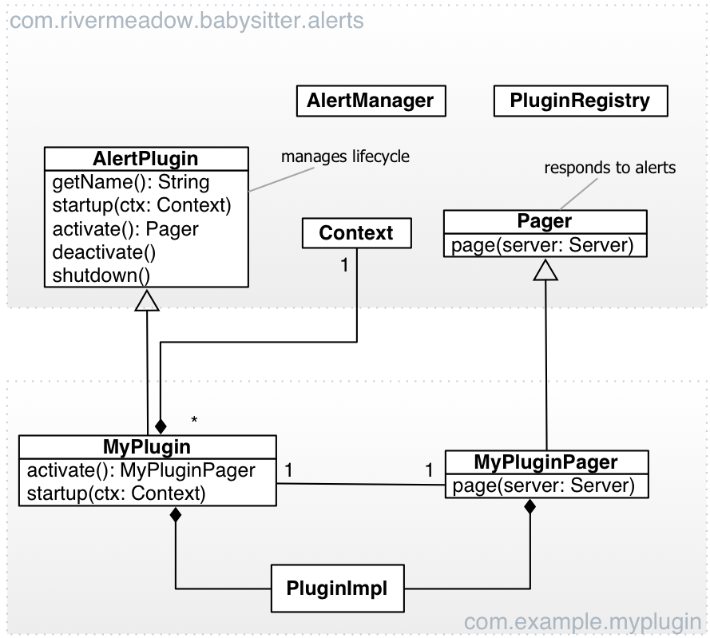

==============================
Babysitter - Monitoring server
==============================

:Date: 2013-10-07
:Author: M. Massenzio
:Version: 0.2
:Updated: 2014-01-24

Use Case
--------

We want an application-level monitoring system that enables a pluggable
alerting system to trigger alerts when ``nodes`` are terminated (for
whatever reason, planned or unplanned).

The monitoring system is "application unaware" in that it does not know any of
the details of any of the services that may be using it, so it is widely applicable
to existing, and future, services, without modifying either the service nodes 
themselves, or the monitoring system when new services are added to the "monitored
pool."

Further, the Monitoring Service will allow arbitrary `Plugins`_ to be added, and
removed, by defining a simple interface.

Zookeeper_ will be used as the main node state tracker.

Architecture
------------

The system is designed to be fully distributed, highly available and resilient to
failures: it can be deployed in "standalone" (one server) mode, or as a set of identical
monitoring nodes; the nodes are entirely unaware of each other's presence, and will continue
to function in the event of failures of any one (or many) of them.

In the diagram below, the dotted box marked `babysitter` should be assumed to be replicated
many times, possibly across data centers - provided the Zookeeper_ ensemble they connect to
shares state.

.. image:: docs/images/babysitter.png
    :width: 400px
    :alt: babysitter architecture

The box ``AlertPlugin`` represents one (of many) Plugins_ components that implement the
``Pager`` interface and the ``AlertPlugin`` lifecycle API specification: not all Babysitter nodes
must have the same set of plugins, however, as only **one** node will trigger an alert in
the event of a monitored node failure, if the given plugin(s) is not installed on that **one**
server, no alert will be generated on that particular adapter.

The babysitter nodes are entirely self-contained, stateless and fully distributed:
they rely on Zookeeper for state, and can be deployed fully indipendently of each other.

Client API
^^^^^^^^^^

Servers currently under monitoring and active::

    POST /api/1/servers
        Will register a new server to be under monitoring; no ``{name}`` in the URL, but the
        body model a ``Server`` object (see Protocol_).
        
    GET /api/1/servers
        Get a list of all servers under monitoring
        
    GET /api/1/servers/{name}
        Retrieves the status and the latest data uploaded by the server registered with ``{name}``

    DELETE /api/1/servers/{name}
        Unregisters the server and stops monitoring; it will not trigger an alert but will cause
        an error to be logged if the server continues to post updates to zookeeper
        
See the Protocol_ section below for an example of the request/response body.
**ToDo** provide an example of the JSON response.

Ongoing alerts can be retrieved using::

    GET /api/1/alerts

an ongoing alert can be "silenced" by using::

    DELETE /api/1/alerts/{id}
    
**ToDo** provide an example of the JSON responses.

Plugins
^^^^^^^

**ToDo** brief description of plugin API

Plugin configuration files are stored in the following system property::

    -Dplugin.config_path="${HOME}/.babysitter/etc"

this is what the ``Context.getConfigPath()`` will return to the plugin's implementation
class (``MyPlugin`` in the diagram).

For more information see Configuration_ below.

Client Libraries
----------------

Python
^^^^^^

From a Python-based server the ``NannyState`` class can be imported and used to
register and update a server to be monitored by ZooKeeper; the server status is
modeled by the ``MonitoredServer`` class, while the ``payload`` object can be of
any form (so long as the size is below ZooKeeper's 1 MB per node limit).

See ``src/main/python/simpleserver.py`` for an example of how to use.

Java
^^^^

There is no current available SDK for Java, but any client that can create a 
node on ZooKeeper as described in Protocol_ can be added to the monitored pool.

Configuration
-------------

*Babysitter* uses `Spring Boot`_ so the ``application.properties`` file will be
loaded according to its rules: essentially, either in the root of the classpath, the
current directory or a `/config` package/subdir of either (in this order).

The application is packaged as a self-contained JAR and can be launched from the
command line with something like this::

    $ java -Djava.util.logging.config.file="src/main/resources/logging.properties" \
        -Dplugin.config_path="${HOME}/.babysitter/etc" \
        -Dbootstrap.location="classpath:/bootstrap.json" -Dserver.port=9009 \
        -jar target/babysitter-<version>.jar

Command-line system properties take precedence over configuration file ones.

Application
^^^^^^^^^^^

The main application configuration file is loaded from the classpath, in the ``application.properties`` file; please note that this is not shipped as part of the package (JAR) so one must be provided.

Example ``application.properties`` file::

    # Configuration for babysitter service

    zookeeper.hosts: localhost:2181,localhost:2182,localhost:2183
    zookeeper.session_timeout: 5000

    # This is the path where all the servers will be attached, as children
    zookeeper.base_path: /monitor/hosts

    # Alerts will be appended as children of this node:
    zookeeper.alerts_path: /monitor/alerts

    # A common place to store configuration information
    zookeeper.config_path: /monitor/config

    server.port: 9000
    bootstrap.location: classpath:/bootstrap.json
    plugin.config_path: /tmp/plugins/config

    # Maximum delay before an AlertManager triggers an alert, in msec
    # currently not used
    alert.max_delay_msec: 5000
    
Most of the configuration properties can be defined on the command line too, via
a system property variable::

    -Dserver.port=9001 -Dboostrap.location=file:///etc/babysitter/bootstrap.json
    

Bootstrapping
^^^^^^^^^^^^^

If ``bootstrap.location`` is defined, the file will be loaded and the
specified nodes created in ZK::

    {
        "paths": [
            "/monitor",
            "/monitor/hosts",
            "/monitor/config",
            "/monitor/alerts"
        ]
    }
    
The number and location of nodes created is entirely arbitrary, but it must at least
ensure that the nodes defined in the ``zookeeper.base_path`` and ``zookeeper.alerts_path``
are created (``zookeeper.config_path`` is currently not used, but it is recommended that
that node is created too).

The location of the file can, as usual, be defined via a system property too::

    -Dbootstrap.location=file:///etc/babysitter/conf/bootstrap.json

Logging
^^^^^^^

We use log4j_ for logging, the configuration follows the standard pattern: a default
``log4j.properties`` is in the classpath (``/src/main/resources/log4j.properties``)::

    # Root logger option
    log4j.rootLogger=DEBUG, stdout

    # Direct log messages to stdout
    log4j.appender.stdout=org.apache.log4j.ConsoleAppender
    log4j.appender.stdout.Target=System.out
    log4j.appender.stdout.layout=org.apache.log4j.PatternLayout

    # WARNING - this is suitable for development/debug, but NOT for production, please replace
    # in production environments with a less expensive pattern layout
    log4j.appender.stdout.layout.ConversionPattern=%d{yyyy-MM-dd HH:mm:ss} %-5p %C{1}.%M:%L - %m%n

    # TODO: add a RollingFileAppender

    log4j.logger.com.rivermeadow = DEBUG
    log4j.logger.org = INFO

This can be changed, specifying the location of the logging configuration file via a system
property::

    -Djava.util.logging.config.file="/etc/babysitter/conf/logging.properties"

Protocol
--------

The monitoring protocol is by design kept as simple as possible: a server is
assumed to be under monitoring if it adds a node in Zookeeper under the
``default monitor`` subtree (currently: ``/monitor/hosts``); and it is assumed
to be terminated when the ephemeral node is removed (in other words, the
zookeeper session is terminated).

Whether this is a planned shutdown or an unexpected failure, it is not for the
monitoring system to decide: the ``AlertManager`` receives an ``unregister`` event
and subsequently all active plugins (see Plugins_ above) will receive a notification
via their ``Pager`` interface.

The ``Server`` object (see below) that is passed to the ``pager`` can then be
inspected to determine whether this is a genuine `failure` (as defined by the
plugin's internal logic) and, if so, what action to take.

Following the alert, the server is placed in a special ``silence`` area (currently,
a node under the ``/hosts/alerts`` zookeeper subtree) and no further alerting
events are generated; if a server with the same ``server_address.hostname`` is
subsequently registered again, the entry in the `silence area` is removed, so that
alerts are re-enable (*note* that it is irrelevant whether the new server is a 
genuine new instance, or the same server who has recovered from whatever temporary
malfunction).
 
The ``Server`` object is in JSON and defined **must** have the following structure::

    {
        "server_address": {
            "ip": "192.168.1.61",
            "hostname": "Marcos-MacBook-Pro.local"
        },
        "type": "simpleserver",
        "port": 0,
        "payload": {
            "#": "The format of this object is arbitrary and can contain any legal JSON",
            "current_time": "Wed Nov 6 23:30:53 2013",
            "state": "running",
            "migrations": [
                {"id": "123456-abcde",
                 "state": "running",
                 "started": "2014-01-22T22:14"},
                {"id": "987654-deadbeef",
                 "state": "running",
                 "started": "2014-01-22T19:14"}
            ]
        },
        "desc": "A simple server to test monitoring"
    }

**Notes**

    ``type``
        is arbitrary and entirely opaque to the monitoring system: this can, for example, be
        used by a plugin to filter out all server who are not of interest/relevance;
        
    ``port``
        similarly, this could be used (while the server is still active) to communicate back
        or interrogate for more information; currently not used;
        
    ``payload``
        as indicated, this is an opaque object that further describes server attributes and
        can be used by the alerting plugins (and even be sent alongside the alert)

.. Links:

.. _Zookeeper: http://zookeeper.apache.org/
.. _log4j: http://logging.apache.org/log4j/1.2/manual.html
.. _Spring Boot: http://projects.spring.io/spring-boot/docs/spring-boot/README.html