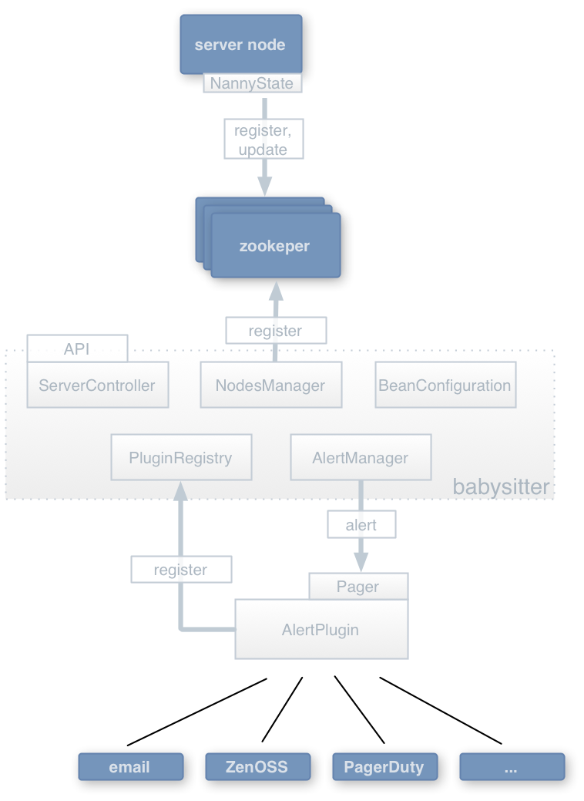

==============================
Babysitter - Monitoring server
==============================

:Date: 2013-10-07
:Author: M. Massenzio
:Version: 0.1
:Updated: 2013-10-07

Use Case
--------

Nodes will send a ``heartbeat`` to the *babysitter* server, with a
specified TTL and other metadata: if the *babysitter* does not hear
from the node within the TTL and for a given number of failed
attempts, it will trigger an alert.

Zookeeper_ will be used as the main node state tracker.

.. _Zookeeper: http://zookeeper.apache.org/

